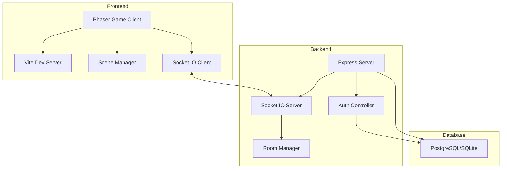

## Technology Stack

Elemental Battlecards is a full-stack multiplayer card game built with modern web technologies.

### Backend Stack

<CardGroup cols={2}>
  <Card title="Node.js + Express" icon="node">
    RESTful API server handling authentication and HTTP endpoints
  </Card>
  <Card title="Socket.IO" icon="bolt">
    Real-time bidirectional communication for multiplayer gameplay
  </Card>
  <Card title="Sequelize ORM" icon="database">
    Database abstraction layer supporting PostgreSQL and SQLite
  </Card>
  <Card title="JWT Authentication" icon="lock">
    Secure token-based authentication with bcrypt password hashing
  </Card>
</CardGroup>

### Frontend Stack

<CardGroup cols={2}>
  <Card title="Phaser 3" icon="gamepad">
    WebGL/Canvas game framework for rendering and game logic
  </Card>
  <Card title="Vite" icon="bolt">
    Lightning-fast build tool with HMR for development
  </Card>
  <Card title="Socket.IO Client" icon="wifi">
    Real-time client for multiplayer synchronization
  </Card>
  <Card title="ES Modules" icon="code">
    Modern JavaScript with native module imports
  </Card>
</CardGroup>

## System Architecture



## Backend Architecture

The backend follows a modular MVC-style structure optimized for real-time multiplayer gaming.

### Directory Structure

```bash
Backend/
├── config/
│   ├── config.js           # Database configuration
│   └── db.js              # Database connection setup
├── controllers/
│   └── authController.js  # Authentication logic
├── models/
│   ├── index.js           # Sequelize initialization
│   └── user.js            # User model definition
├── routes/
│   └── authRoutes.js      # Authentication endpoints
├── migrations/
│   └── *.js              # Database migrations
├── server.js             # Application entry point
├── socketManager.js      # Real-time game logic
└── show-network-info.js  # Network utilities
```

### Core Server Setup

The main server (`server.js`) initializes the application with database connection and Socket.IO:

```javascript Backend/server.js
require('dotenv').config();
const express = require('express');
const http = require('http');
const cors = require('cors');
const { Server } = require('socket.io');

const app = express();
const PORT = process.env.PORT || 3001;

// Middleware
app.use(cors());
app.use(bodyParser.json());

// Authentication routes (when DB enabled)
if (dbEnabled && sequelize) {
    const authRoutes = require('./routes/authRoutes');
    app.use('/api/auth', authRoutes);
}

// Create HTTP server and Socket.IO
const server = http.createServer(app);
const io = new Server(server, { cors: { origin: '*' } });

// Initialize socket manager
socketManager(io);

server.listen(PORT, '0.0.0.0');
```

### Database Layer

**User Model** (`models/user.js`):

```javascript
module.exports = (sequelize, DataTypes) => {
  const User = sequelize.define('User', {
    username: { 
      type: DataTypes.STRING, 
      allowNull: false,
      unique: true
    },
    email: { 
      type: DataTypes.STRING, 
      allowNull: false,
      unique: true
    },
    password: { 
      type: DataTypes.STRING, 
      allowNull: false 
    }
  }, {
    tableName: 'users',
    timestamps: true
  });
  return User;
};
```

### API Endpoints

<CodeGroup>
```bash POST /api/auth/register
curl -X POST http://localhost:3001/api/auth/register \
  -H "Content-Type: application/json" \
  -d '{
    "username": "player1",
    "email": "player1@example.com",
    "password": "securepass123"
  }'
```

```bash POST /api/auth/login
curl -X POST http://localhost:3001/api/auth/login \
  -H "Content-Type: application/json" \
  -d '{
    "username": "player1",
    "password": "securepass123"
  }'
```

```bash GET /ping
curl http://localhost:3001/ping
# Response: {"ok": true, "time": 1234567890, "host": "localhost"}
```
</CodeGroup>

### Real-Time Socket Manager

The `socketManager.js` handles all real-time multiplayer logic:

- **Room Management**: Creates 6-digit room codes for LAN games
- **Player Matching**: Manages host/guest connections
- **Game State**: Synchronizes turn changes and game events
- **Connection Handling**: Cleanup on disconnect

See [Socket Events](/development/socket-events) for detailed event documentation.

## Frontend Architecture

### Directory Structure

```bash
Frontend/
├── public/
│   └── assets/
│       └── images/          # Game assets (cards, backgrounds)
├── src/
│   ├── game_objects/        # Card, Player classes
│   ├── helpers/             # Combat, zones, constants
│   ├── scenes/              # Phaser game scenes
│   │   ├── LoginScene.js
│   │   ├── RegisterScene.updated.js
│   │   ├── Preloader.js
│   │   ├── HomeScenes.js
│   │   ├── CreateRoomScene.js
│   │   ├── GameSceneLAN.js
│   │   ├── GameScene.js
│   │   └── uiScene.js
│   └── main.js             # Phaser configuration
├── index.html
├── package.json
└── vite.config.js
```

### Phaser Configuration

The game is initialized in `main.js` with specific scene order:

```javascript Frontend/src/main.js
import Phaser from 'phaser';
import LoginScene from './scenes/LoginScene.js';
import RegisterScene from './scenes/RegisterScene.updated.js';
import PreloaderScene from './scenes/Preloader.js';
import GameScene from './scenes/GameScene.js';
import UIScene from './scenes/uiScene.js';
import HomeScenes from './scenes/homeScenes.js';
import CreateRoomScene from './scenes/createRoomScene.js';
import GameSceneLAN from './scenes/GameSceneLAN.js';

const config = {
    type: Phaser.AUTO,
    dom: { createContainer: true },
    width: 1600,
    height: 1000,
    scale: {
        mode: Phaser.Scale.FIT,
        autoCenter: Phaser.Scale.CENTER_BOTH
    },
    parent: 'game-container',
    scene: [
        LoginScene, 
        RegisterScene, 
        PreloaderScene, 
        HomeScenes, 
        CreateRoomScene, 
        GameSceneLAN, 
        GameScene, 
        UIScene
    ]
}

const game = new Phaser.Game(config);
```

### Game Objects

<CardGroup cols={2}>
  <Card title="Card Class" icon="square">
    Represents individual cards with type, level, and state management
  </Card>
  <Card title="Player Class" icon="user">
    Manages player state including deck, hand, field, and essences
  </Card>
  <Card title="Card Definitions" icon="book">
    Static configuration for all card types and levels
  </Card>
  <Card title="Combat Resolver" icon="shield">
    Calculates battle outcomes based on type advantages and levels
  </Card>
</CardGroup>

## Game State Management

### Turn System

The game uses a turn-based state machine:

1. **Pre-start**: Waiting for both players to be ready
2. **Player Turn**: Local player can perform one action
3. **Opponent Turn**: Waiting for opponent action
4. **Game Over**: Victory or defeat condition met

### Action Types

- **Place Card**: Put a card from hand onto field (face-down)
- **Attack**: Select attacker and target, resolve combat
- **Fuse**: Combine two identical cards to level up

### Synchronization

All game actions are synchronized via Socket.IO events:

```javascript
// Send action to opponent
socket.emit('game_event', {
    type: 'place_card',
    position: 3,
    cardIndex: 1
});

// Receive opponent action
socket.on('game_event', (payload) => {
    handleOpponentAction(payload);
});
```

## Environment Configuration

### Backend Environment Variables

```bash .env
# Server
PORT=3001

# Database
DB_ENABLED=true
DB_HOST=localhost
DB_PORT=5432
DB_NAME=battlecards
DB_USER=postgres
DB_PASSWORD=password
DB_REQUIRE_SSL=false

# Authentication
JWT_SECRET=your_secret_key_here
```

### Frontend Environment

The frontend determines the backend URL dynamically:

1. Query parameter: `?backend=http://192.168.1.100:3001`
2. Global variable: `window.BACKEND_URL`
3. Default: `http://{location.hostname}:3001`

<Note>
  This flexible approach allows LAN gaming where players connect to a local server via IP address.
</Note>

## Deployment

### Development Mode

<Tabs>
  <Tab title="Backend">
    ```bash
    cd Backend
    npm install
    npm run dev  # Uses nodemon for auto-restart
    ```
  </Tab>
  <Tab title="Frontend">
    ```bash
    cd Frontend
    npm install
    npm run dev  # Vite dev server with HMR
    ```
  </Tab>
</Tabs>

### Production Build

```bash
# Frontend
cd Frontend
npm run build  # Outputs to dist/

# Backend
cd Backend
npm start  # Runs server.js with node
```

### Network Configuration

For LAN play, the backend displays network information on startup:

```
🎮 Elemental Battlecards Server
✅ Running on http://192.168.1.100:3001

Share this URL with players on your network!
```

## Performance Considerations

### Asset Loading

- Video backgrounds use `muted: true` for autoplay compatibility
- Mipmaps generated during load to prevent WebGL warnings
- Card textures normalized to fixed sizes (110x158px)

### Memory Management

- Scene cleanup removes event listeners on shutdown
- Socket connections preserved when transitioning between game scenes
- DOM elements properly destroyed to prevent leaks

### Network Optimization

- Binary WebSocket protocol via Socket.IO
- Events only sent on state changes, not every frame
- Room-based message routing reduces bandwidth

## Security

<CardGroup cols={2}>
  <Card title="Password Hashing" icon="key">
    bcryptjs with salt rounds for secure password storage
  </Card>
  <Card title="JWT Tokens" icon="shield-alt">
    Stateless authentication with configurable expiration
  </Card>
  <Card title="CORS Configuration" icon="globe">
    Controlled cross-origin resource sharing
  </Card>
  <Card title="Input Validation" icon="check-circle">
    Server-side validation of all game events
  </Card>
</CardGroup>

## Next Steps

<CardGroup cols={2}>
  <Card title="Game Scenes" href="/development/game-scenes">
    Learn about all Phaser scenes and their flow
  </Card>
  <Card title="Socket Events" href="/development/socket-events">
    Complete reference of real-time multiplayer events
  </Card>
  <Card title="Contributing" href="/development/contributing">
    Guidelines for contributing to the project
  </Card>
</CardGroup>