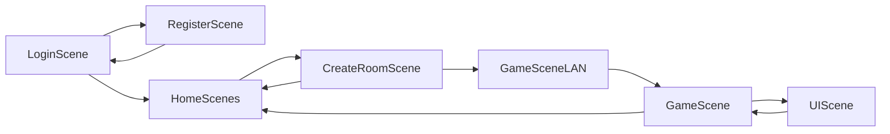

## Scene Architecture

Elemental Battlecards uses Phaser's scene management system to organize the game into discrete screens and states. Each scene handles a specific part of the user experience.

### Scene Flow Diagram



## Scene Loading Order

The scenes are registered in this specific order in `main.js`:

```javascript Frontend/src/main.js
scene: [
    LoginScene,        // 1. Entry point for authentication
    RegisterScene,     // 2. User registration
    PreloaderScene,    // 3. Asset loading (not in flow, utility)
    HomeScenes,        // 4. Main menu/lobby
    CreateRoomScene,   // 5. Room creation and joining
    GameSceneLAN,      // 6. LAN game transition
    GameScene,         // 7. Main gameplay scene
    UIScene            // 8. Overlaid UI scene
]
```

<Note>
  Phaser starts the first scene in the array (`LoginScene`) automatically when the game initializes.
</Note>

## Authentication Scenes

### LoginScene

**Purpose**: First screen users see, handles authentication and entry to the game.

**Key Features**:
- Video background loop for visual appeal
- Username and password input fields
- Link to registration scene
- Placeholder buttons for News, Credits, Contact

**Code Structure**:

```javascript Frontend/src/scenes/LoginScene.js
export default class LoginScene extends Phaser.Scene {
    constructor() {
        super('LoginScene');
    }

    preload() {
        this.load.video('inicio-video', '/assets/images/inicio/inicio.mp4');
        this.load.image('logo', '/assets/images/Logotipoletras.png');
    }

    create() {
        // Setup video background
        this.bg = this.add.video(width / 2, height / 2, 'inicio-video');
        this.bg.play(true); // Loop
        
        // Create DOM form for inputs
        this.formElement = this.add.dom(width / 2, height / 2)
            .createFromHTML(formHTML);
        
        // Handle login button
        loginButton.addEventListener('click', async () => {
            const res = await fetch(scriptURL, {
                method: 'POST',
                headers: { 'Content-Type': 'application/json' },
                body: JSON.stringify({ username, password })
            });
            
            if (res.ok && json.token) {
                localStorage.setItem('token', json.token);
                this.scene.start('HomeScenes');
            }
        });
    }
}
```

**API Endpoint**: `POST https://elemental-battlecards.onrender.com/api/auth/login`

**Navigation**:
- Success → `HomeScenes`
- "Create Account" link → `RegisterScene`

### RegisterScene

**Purpose**: New user account creation with validation.

**Key Features**:
- Same video background as LoginScene for consistency
- Username, email, password, and password confirmation fields
- Client-side validation (email format, password match)
- Link back to login

**Validation Logic**:

```javascript Frontend/src/scenes/RegisterScene.updated.js
// Field validation
if (!username || !email || !password || !passwordConfirm) {
    alert('Completa todos los campos.');
    return;
}

if (password !== passwordConfirm) {
    alert('Las contraseñas no coinciden.');
    return;
}

// Email validation
if (!/^[^@\s]+@[^@\s]+\.[^@\s]+$/.test(email)) {
    alert('Introduce un email válido.');
    return;
}
```

**API Endpoint**: `POST https://elemental-battlecards.onrender.com/api/auth/register`

**Navigation**:
- Success → `LoginScene`
- "Already have account" link → `LoginScene`

## Menu and Lobby Scenes

### HomeScenes

**Purpose**: Main hub after login where players choose game mode and access settings.

**Key Features**:
<CardGroup cols={2}>
  <Card title="Game Modes" icon="gamepad">
    - Play in LAN (multiplayer)
    - Play vs Bot (single-player)
  </Card>
  <Card title="Player Stats" icon="chart-line">
    - Games played
    - Games won
    - Achievements
    - Playtime
  </Card>
  <Card title="Modals" icon="window-maximize">
    - Configuration
    - About the game
    - Game mechanics guide
  </Card>
  <Card title="User Info" icon="user">
    - Username display
    - Logout button
  </Card>
</CardGroup>

**Layout Structure**:

```javascript Frontend/src/scenes/homeScenes.js
create() {
    // Left panel: Play options
    const playPanel = `
        <button id="play">Jugar en LAN</button>
        <button id="play-bot">Jugar con bot</button>
    `;
    
    // Right panel: Stats and actions
    const statsPanel = `
        <div class="stats-grid">
            <span>Partidas jugadas</span> <span>0</span>
            <span>Partidas ganadas</span> <span>0</span>
        </div>
        <button data-modal="mechanics">Mecánicas del juego</button>
    `;
    
    // Modal system for displaying rules
    const openModal = (title, htmlContent) => {
        modalTitle.textContent = title;
        modalBody.innerHTML = htmlContent;
        modalOverlay.classList.add('show');
    };
}
```

**Navigation**:
- "Jugar en LAN" → `CreateRoomScene`
- "Jugar con bot" → `GameScene` (with `vsBot: true`)
- "Salir" → `LoginScene`

### PreloaderScene

**Purpose**: Utility scene for preloading game assets with progress indicator.

**Asset Loading**:

```javascript Frontend/src/scenes/Preloader.js
preload() {
    this.createLoadingBar();
    
    // Card backs
    this.load.image('card_back', '/assets/images/cartas/abajo.png');
    
    // All card fronts (6 types × 3 levels)
    const types = ['fuego', 'agua', 'planta', 'luz', 'sombra', 'espiritu'];
    for (const type of types) {
        for (let level = 1; level <= 3; level++) {
            const key = `${type}_${level}`;
            this.load.image(key, `/assets/images/cartas/carta-${type}-${level}.png`);
        }
    }
}
```

<Note>
  This scene can be called from any other scene when additional assets need loading.
</Note>

## Multiplayer Scenes

### CreateRoomScene

**Purpose**: Handles room creation and joining for LAN multiplayer games.

**Key Features**:
<Tabs>
  <Tab title="Host Panel">
    - Create new room with 6-digit code
    - Display room code with copy button
    - Show player count (1/2)
    - Wait for second player to join
    - Start game when ready
  </Tab>
  <Tab title="Join Panel">
    - Input field for room code
    - Join existing room
    - Validation for 6-digit codes
  </Tab>
</Tabs>

**Socket Integration**:

```javascript Frontend/src/scenes/createRoomScene.js
create() {
    // Determine backend URL
    const params = new URLSearchParams(window.location.search);
    let SERVER_URL = params.get('backend') || 
                     window.BACKEND_URL || 
                     `http://${location.hostname}:3001`;
    
    // Connect to Socket.IO server
    this.socket = io(SERVER_URL);
    
    // Create room button
    startBtn.addEventListener('click', () => {
        if (!this.currentRoom) {
            this.socket.emit('create_room', (res) => {
                if (res.success) {
                    this.playerRole = res.role; // 'host'
                    updateCodeUI(res.code);
                }
            });
        }
    });
    
    // Join room button
    joinBtn.onclick = () => {
        const code = rawCode.replace(/\s+/g, '');
        this.socket.emit('join_room', { code }, (res) => {
            if (res.success) {
                this.playerRole = res.role; // 'guest'
                this.currentRoom = res.code;
            }
        });
    };
    
    // Auto-start when room is full
    this.socket.on('game_start', (data) => {
        this.keepSocket = true;
        this.scene.start('GameSceneLAN', {
            roomCode: this.currentRoom,
            socket: this.socket,
            playerData: this.playerData,
            playerRole: this.playerRole,
            gameStartData: data
        });
    });
}
```

**Room Code Format**: 6 digits displayed as `XXX XXX` (e.g., `123 456`)

**Navigation**:
- "Salir" → `HomeScenes`
- Auto-transition when game starts → `GameSceneLAN`

### GameSceneLAN

**Purpose**: Transition scene that ensures socket connection is established before entering gameplay.

**Responsibility**: 
- Verify socket connection
- Ensure room membership
- Pass all context to GameScene

```javascript Frontend/src/scenes/GameSceneLAN.js
export default class GameSceneLAN extends Phaser.Scene {
    init(data) {
        this.playerData = data.playerData;
        this.roomCode = data.roomCode;
        this.socket = data.socket;
        this.playerRole = data.playerRole; // 'host' or 'guest'
        this.gameStartData = data.gameStartData;
    }

    create() {
        // Ensure socket is connected
        if (!this.socket) {
            this.socket = io(SERVER_URL);
        }
        
        // Transition to main game scene
        this.scene.start('GameScene', {
            playerData: this.playerData,
            roomCode: this.roomCode,
            socket: this.socket,
            isLAN: true,
            playerRole: this.playerRole,
            gameStartData: this.gameStartData
        });
    }
}
```

**Navigation**: Always → `GameScene`

## Gameplay Scenes

### GameScene

**Purpose**: The main gameplay scene where all card game logic executes.

**Responsibilities**:
<CardGroup cols={2}>
  <Card title="Game State" icon="cogs">
    - Turn management
    - Action validation
    - Win condition checking
  </Card>
  <Card title="Players" icon="users">
    - Player and opponent data
    - Deck, hand, field management
    - Essence tracking
  </Card>
  <Card title="Card Logic" icon="square">
    - Placing cards
    - Combat resolution
    - Fusion mechanics
  </Card>
  <Card title="Networking" icon="network-wired">
    - Send actions to opponent
    - Receive and process remote actions
    - State synchronization
  </Card>
</CardGroup>

**Game State Machine**:

```javascript Frontend/src/scenes/GameScene.js
init(data) {
    this.playerData = data.playerData;
    this.socket = data.socket;
    this.isLAN = !!data.isLAN;
    this.roomCode = data.roomCode;
    this.playerRole = data.playerRole;
    this.vsBot = !!data.vsBot;
}

create() {
    this.gameState = 'pre-start';
    // States: 'pre-start', 'player-turn', 'opponent-turn', 'game-over'
    
    // Create players
    this.player = new Player('player', this);
    this.opponent = new Player('opponent', this);
    
    // Setup field zones
    this.setupFieldZones();
    
    // Socket event listeners
    if (this.isLAN && this.socket) {
        this.socket.on('game_event', (payload) => {
            this.handleOpponentAction(payload);
        });
        
        this.socket.on('turn_changed', (data) => {
            this.handleTurnChange(data);
        });
    }
    
    // Launch UIScene in parallel
    this.scene.launch('UIScene', { playerData: this.playerData });
}
```

**Turn System**:

```javascript
startPlayerTurn() {
    this.gameState = 'player-turn';
    this.playerHasActed = false;
    this.playerTurnNumber++;
    
    // Check if attack is mandatory
    this.playerTurnsSinceLastAttack++;
    if (this.playerTurnsSinceLastAttack >= 3) {
        this.playerMustAttackThisTurn = true;
    }
    
    // Start 12-second turn timer
    this.startTurnTimer();
}

endPlayerTurn() {
    if (this.socket && this.isLAN) {
        this.socket.emit('end_turn', {
            playerRole: this.playerRole
        });
    }
    
    this.gameState = 'opponent-turn';
}
```

**Action Types**:

<Tabs>
  <Tab title="Place Card">
    ```javascript
    placeCard(cardIndex, fieldPosition) {
        if (!this.canPlayerAct()) return;
        
        const card = this.player.hand[cardIndex];
        this.player.field[fieldPosition] = card;
        card.setFaceDown(true);
        
        // Notify opponent
        this.socket.emit('game_event', {
            type: 'place_card',
            position: fieldPosition
        });
        
        this.playerHasActed = true;
        this.endPlayerTurn();
    }
    ```
  </Tab>
  <Tab title="Attack">
    ```javascript
    attackCard(attackerIndex, targetIndex) {
        if (!this.canPlayerAct()) return;
        
        const attacker = this.player.field[attackerIndex];
        const target = this.opponent.field[targetIndex];
        
        const result = resolveCombat(attacker, target);
        
        // Notify opponent
        this.socket.emit('game_event', {
            type: 'attack',
            attackerIndex,
            targetIndex,
            result
        });
        
        this.playerPerformedAttackThisTurn = true;
        this.playerTurnsSinceLastAttack = 0;
        this.playerHasActed = true;
        this.endPlayerTurn();
    }
    ```
  </Tab>
  <Tab title="Fuse">
    ```javascript
    fuseCards(index1, index2) {
        if (!this.canPlayerAct()) return;
        
        const card1 = this.player.field[index1];
        const card2 = this.player.field[index2];
        
        if (card1.type !== card2.type || card1.level !== card2.level) {
            return; // Cannot fuse
        }
        
        const newCard = new Card(card1.type, card1.level + 1);
        this.player.field[index1] = newCard;
        this.player.field[index2] = null;
        
        // Notify opponent
        this.socket.emit('game_event', {
            type: 'fuse',
            index1,
            index2,
            resultType: newCard.type,
            resultLevel: newCard.level
        });
        
        this.playerHasActed = true;
        this.endPlayerTurn();
    }
    ```
  </Tab>
</Tabs>

**Preload Assets**:

```javascript
preload() {
    // Background
    this.load.video('campo-video', '/assets/images/campo juego/campo.mp4');
    
    // Slots
    this.load.image('slot', '/assets/images/cartas/Espacio vacio.png');
    
    // All card images (6 types × 3 levels)
    for (const type of types) {
        for (let level = 1; level <= 3; level++) {
            this.load.image(
                `card-${type}-${level}`,
                `/assets/images/cartas/carta-${type}-${level}.png`
            );
        }
    }
}
```

### UIScene

**Purpose**: Overlaid UI scene running parallel to GameScene, displays HUD elements.

**Key Features**:
- Player vs Opponent header
- Essence orbs for both players
- Turn indicator
- Menu (settings, surrender)
- "Start Game" button

**Scene Launching**:

```javascript Frontend/src/scenes/uiScene.js
export default class UIScene extends Phaser.Scene {
    create(data) {
        this.playerData = data.playerData;
        
        // Get reference to GameScene
        this.gameScene = this.scene.get('GameScene');
        
        // Create UI elements
        this.createEssenceOrbs();
        this.createHeader();
        this.createMenuButton();
    }
    
    createEssenceOrbs() {
        const types = ['fuego', 'agua', 'planta', 'luz', 'espiritu', 'sombra'];
        
        types.forEach((type, index) => {
            // Player orbs (bottom)
            const playerOrb = this.add.image(x, y, `orb-${type}`);
            playerOrb.setAlpha(0.3); // Dimmed when empty
            this.playerOrbs[type] = playerOrb;
            
            // Opponent orbs (top)
            const opponentOrb = this.add.image(x, y, `orb-${type}`);
            opponentOrb.setAlpha(0.3);
            this.opponentOrbs[type] = opponentOrb;
        });
    }
}
```

**Communication with GameScene**:

```javascript
// UIScene updates based on GameScene events
this.gameScene.events.on('essence_collected', (data) => {
    const { player, type } = data;
    if (player === 'player') {
        this.playerOrbs[type].setAlpha(1); // Light up
    } else {
        this.opponentOrbs[type].setAlpha(1);
    }
});
```

## Scene Transitions

### Data Passing Between Scenes

Phaser scenes can pass data during transitions:

```javascript
// From LoginScene to HomeScenes
this.scene.start('HomeScenes', { 
    username: 'player1',
    token: 'jwt_token_here' 
});

// From CreateRoomScene to GameSceneLAN
this.scene.start('GameSceneLAN', {
    roomCode: '123456',
    socket: this.socket,
    playerData: this.playerData,
    playerRole: 'host'
});
```

### Scene Start vs Launch

<CodeGroup>
```javascript scene.start()
// Stops current scene and starts new one
this.scene.start('GameScene', data);
```

```javascript scene.launch()
// Runs scene in parallel (used for UI overlay)
this.scene.launch('UIScene', data);
```
</CodeGroup>

## Scene Lifecycle

Every Phaser scene follows this lifecycle:

1. **init(data)**: Receives data from previous scene
2. **preload()**: Loads assets
3. **create()**: Initializes scene objects and logic
4. **update(time, delta)**: Called every frame (optional)
5. **shutdown()**: Called when scene stops
6. **destroy()**: Called when scene is destroyed

```javascript
export default class ExampleScene extends Phaser.Scene {
    init(data) {
        // Setup variables with passed data
    }
    
    preload() {
        // Load assets
    }
    
    create() {
        // Create game objects
        this.events.on('shutdown', this.onShutdown, this);
    }
    
    update(time, delta) {
        // Run every frame (optional)
    }
    
    onShutdown() {
        // Cleanup: remove listeners, destroy objects
        this.events.off('shutdown', this.onShutdown, this);
    }
}
```

## Best Practices

<CardGroup cols={2}>
  <Card title="Memory Management" icon="memory">
    Always remove event listeners in shutdown/destroy to prevent memory leaks
  </Card>
  <Card title="Socket Persistence" icon="plug">
    Use flags like `keepSocket` to preserve connections between scenes
  </Card>
  <Card title="Responsive Design" icon="mobile-alt">
    Implement `resize()` handlers for all scenes with dynamic layouts
  </Card>
  <Card title="Error Handling" icon="exclamation-triangle">
    Validate scene data in `init()` and provide fallbacks
  </Card>
</CardGroup>

## Next Steps

<CardGroup cols={2}>
  <Card title="Socket Events" href="/development/socket-events">
    Learn how scenes communicate in multiplayer
  </Card>
  <Card title="Architecture" href="/development/architecture">
    Understand the overall system design
  </Card>
</CardGroup>