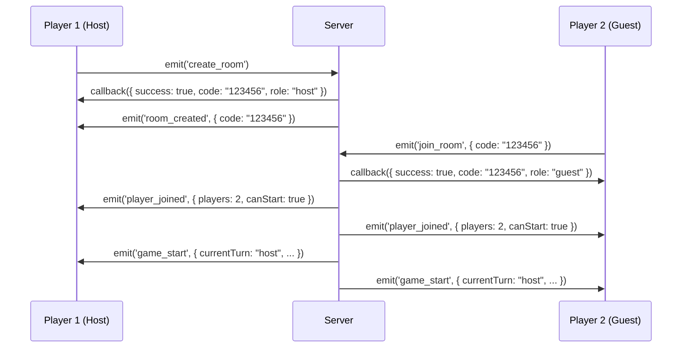
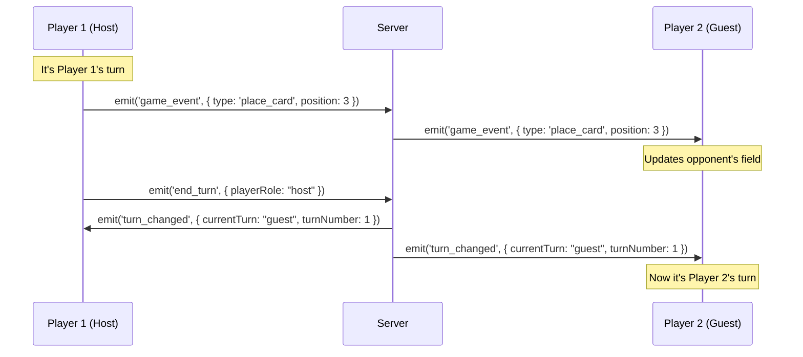

## Overview

Elemental Battlecards uses Socket.IO for real-time bidirectional communication between clients and server. All multiplayer functionality is handled through socket events defined in `socketManager.js`.

## Connection Management

### Server-Side Socket Initialization

```javascript Backend/socketManager.js
module.exports = function(io) {
    const rooms = {}; // { code: { players: [], gameState: {} } }
    global.activeRooms = rooms; // Expose for debugging
    
    io.on('connection', (socket) => {
        console.log('Socket conectado:', socket.id, socket.handshake.address);
        
        // Event handlers...
    });
};
```

### Client-Side Connection

```javascript Frontend/src/scenes/createRoomScene.js
import { io } from 'socket.io-client';

const SERVER_URL = `http://${location.hostname}:3001`;
this.socket = io(SERVER_URL);

this.socket.on('connect', () => {
    console.log('Connected:', this.socket.id);
});
```

## Room Management Events

### create_room

**Direction**: Client → Server

**Purpose**: Creates a new game room with a unique 6-digit code.

**Client Request**:
```javascript
this.socket.emit('create_room', (response) => {
    console.log(response);
    // { success: true, code: "123456", role: "host" }
});
```

**Server Handler**:
```javascript Backend/socketManager.js
socket.on('create_room', (cb) => {
    let code;
    do {
        code = generateCode(); // 6-digit number
    } while (rooms[code]);
    
    rooms[code] = {
        players: [{ socketId: socket.id, role: 'host' }],
        gameState: {
            currentTurn: 'host',
            turnNumber: 0
        },
        createdAt: Date.now()
    };
    
    socket.join(code);
    socket.roomCode = code;
    socket.playerRole = 'host';
    
    if (typeof cb === 'function') {
        cb({ success: true, code, role: 'host' });
    }
    
    io.to(code).emit('room_created', { code });
});
```

**Response**:

<ResponseField name="success" type="boolean">
  Whether room creation succeeded
</ResponseField>

<ResponseField name="code" type="string">
  The 6-digit room code (e.g., "123456")
</ResponseField>

<ResponseField name="role" type="string">
  Player's role in the room ("host")
</ResponseField>

### room_created

**Direction**: Server → Client(s)

**Purpose**: Notifies all clients in the room that it was successfully created.

**Payload**:
```javascript
{
    code: "123456"
}
```

**Client Handler**:
```javascript
this.socket.on('room_created', ({ code }) => {
    console.log('Room created with code:', code);
    this.currentRoom = code;
});
```

### join_room

**Direction**: Client → Server

**Purpose**: Join an existing room using a 6-digit code.

**Client Request**:
```javascript
const code = "123456";
this.socket.emit('join_room', { code }, (response) => {
    if (response.success) {
        console.log('Joined room:', response.code);
        console.log('Role:', response.role); // "guest"
    } else {
        console.error('Failed to join:', response.message);
    }
});
```

**Server Handler**:
```javascript Backend/socketManager.js
socket.on('join_room', (data, cb) => {
    const code = (data && data.code) ? data.code.toString().replace(/\s+/g, '') : null;
    
    if (!code || !rooms[code]) {
        if (typeof cb === 'function') {
            cb({ success: false, message: 'Sala no encontrada.' });
        }
        return;
    }
    
    const room = rooms[code];
    if (room.players.length >= 2) {
        if (typeof cb === 'function') {
            cb({ success: false, message: 'Sala llena.' });
        }
        return;
    }
    
    room.players.push({ socketId: socket.id, role: 'guest' });
    socket.join(code);
    socket.roomCode = code;
    socket.playerRole = 'guest';
    
    if (typeof cb === 'function') {
        cb({ success: true, code, role: 'guest' });
    }
    
    // Notify both players
    io.to(code).emit('player_joined', {
        players: room.players.length,
        canStart: room.players.length === 2
    });
    
    // Auto-start game when room is full
    if (room.players.length === 2) {
        io.to(code).emit('game_start', {
            currentTurn: 'host',
            hostId: room.players[0].socketId,
            guestId: room.players[1].socketId
        });
    }
});
```

**Request Payload**:
<ResponseField name="code" type="string" required>
  6-digit room code to join
</ResponseField>

**Response (Success)**:
```json
{
    "success": true,
    "code": "123456",
    "role": "guest"
}
```

**Response (Failure)**:
```json
{
    "success": false,
    "message": "Sala no encontrada." | "Sala llena."
}
```

### player_joined

**Direction**: Server → All Clients in Room

**Purpose**: Notifies when a player joins the room.

**Payload**:
```javascript
{
    players: 2,        // Total players in room
    canStart: true     // Whether game can start (2 players)
}
```

**Client Handler**:
```javascript
this.socket.on('player_joined', ({ players, canStart }) => {
    this.playersInRoom = players;
    
    if (canStart) {
        this.startButton.textContent = '¡Iniciar Partida!';
    }
});
```

### player_left

**Direction**: Server → All Clients in Room

**Purpose**: Notifies when a player disconnects from the room.

**No Payload**

**Client Handler**:
```javascript
this.socket.on('player_left', () => {
    this.playersInRoom = Math.max(1, this.playersInRoom - 1);
    console.log('Player left, waiting for replacement...');
});
```

## Game Flow Events

### game_start

**Direction**: Server → All Clients in Room

**Purpose**: Signals that the game can begin (2 players connected).

**Payload**:
```javascript
{
    currentTurn: "host",           // Who starts
    hostId: "socket_id_1",         // Host socket ID
    guestId: "socket_id_2",        // Guest socket ID
}
```

**Client Handler**:
```javascript
this.socket.on('game_start', (data) => {
    console.log('Game starting...', data);
    
    // Transition to game scene
    this.scene.start('GameSceneLAN', {
        roomCode: this.currentRoom,
        socket: this.socket,
        playerRole: this.playerRole,
        gameStartData: data
    });
});
```

### game_event

**Direction**: Bidirectional (Client ↔ Server ↔ Other Client)

**Purpose**: Generic event for all in-game actions (place card, attack, fuse).

**Client Send**:
```javascript
this.socket.emit('game_event', {
    type: 'place_card',
    position: 3,
    cardIndex: 1
});

this.socket.emit('game_event', {
    type: 'attack',
    attackerIndex: 2,
    targetIndex: 4,
    result: 'attacker_wins'
});

this.socket.emit('game_event', {
    type: 'fuse',
    index1: 0,
    index2: 1,
    resultType: 'fuego',
    resultLevel: 2
});
```

**Server Handler**:
```javascript Backend/socketManager.js
socket.on('game_event', (payload) => {
    const code = socket.roomCode;
    if (!code || !rooms[code]) return;
    
    // Rebroadcast to other player(s) in room
    socket.to(code).emit('game_event', payload);
    
    console.log(`Evento ${payload.type} reenviado en sala ${code}`);
});
```

**Client Receive**:
```javascript
this.socket.on('game_event', (payload) => {
    switch (payload.type) {
        case 'place_card':
            this.handleOpponentPlaceCard(payload);
            break;
        case 'attack':
            this.handleOpponentAttack(payload);
            break;
        case 'fuse':
            this.handleOpponentFuse(payload);
            break;
    }
});
```

**Event Types**:

<Tabs>
  <Tab title="place_card">
    **Payload**:
    ```javascript
    {
        type: "place_card",
        position: 3,        // Field position (0-5)
        cardIndex: 1        // Index in hand (optional)
    }
    ```
    Places a card face-down on the field.
  </Tab>
  
  <Tab title="attack">
    **Payload**:
    ```javascript
    {
        type: "attack",
        attackerIndex: 2,   // Attacker field position
        targetIndex: 4,     // Target field position
        result: "attacker_wins" | "defender_wins" | "neutral"
    }
    ```
    Resolves combat between two cards.
  </Tab>
  
  <Tab title="fuse">
    **Payload**:
    ```javascript
    {
        type: "fuse",
        index1: 0,          // First card position
        index2: 1,          // Second card position
        resultType: "fuego",// Type of fused card
        resultLevel: 2      // Level of fused card
    }
    ```
    Combines two identical cards to level up.
  </Tab>
</Tabs>

## Turn Management Events

### end_turn

**Direction**: Client → Server

**Purpose**: Player signals their turn is complete.

**Client Send**:
```javascript
this.socket.emit('end_turn', {
    playerRole: this.playerRole // "host" or "guest"
});
```

**Server Handler**:
```javascript Backend/socketManager.js
socket.on('end_turn', (payload) => {
    const code = socket.roomCode;
    if (!code || !rooms[code]) return;
    
    const room = rooms[code];
    const currentRole = socket.playerRole;
    
    // Alternate turn
    room.gameState.currentTurn = currentRole === 'host' ? 'guest' : 'host';
    room.gameState.turnNumber++;
    
    // Notify both players
    io.to(code).emit('turn_changed', {
        currentTurn: room.gameState.currentTurn,
        turnNumber: room.gameState.turnNumber
    });
});
```

### turn_changed

**Direction**: Server → All Clients in Room

**Purpose**: Notifies all players of turn change.

**Payload**:
```javascript
{
    currentTurn: "guest",  // "host" or "guest"
    turnNumber: 5          // Total turns elapsed
}
```

**Client Handler**:
```javascript
this.socket.on('turn_changed', ({ currentTurn, turnNumber }) => {
    console.log(`Turn ${turnNumber}: ${currentTurn}'s turn`);
    
    if (currentTurn === this.playerRole) {
        this.startPlayerTurn();
    } else {
        this.startOpponentTurn();
    }
});
```

## Connection Events

### disconnect

**Direction**: Client → Server (Automatic)

**Purpose**: Cleanup when a player disconnects.

**Server Handler**:
```javascript Backend/socketManager.js
socket.on('disconnect', () => {
    const code = socket.roomCode;
    console.log('Socket desconectado:', socket.id, 'sala:', code);
    
    if (code && rooms[code]) {
        // Remove player from room
        rooms[code].players = rooms[code].players.filter(
            p => p.socketId !== socket.id
        );
        
        if (rooms[code].players.length === 0) {
            // Delete empty room
            delete rooms[code];
            console.log(`Sala ${code} eliminada (vacía)`);
        } else {
            // Notify remaining player
            io.to(code).emit('player_left');
        }
    }
});
```

## Room Data Structure

The server maintains room state in memory:

```javascript
const rooms = {
    "123456": {
        players: [
            { socketId: "abc123", role: "host" },
            { socketId: "def456", role: "guest" }
        ],
        gameState: {
            currentTurn: "host",    // "host" or "guest"
            turnNumber: 0           // Increments each turn
        },
        createdAt: 1234567890       // Timestamp
    }
}
```

<Note>
  Rooms are stored in memory and cleared when all players disconnect. For persistent games, implement database storage.
</Note>

## Complete Event Flow Example

### Creating and Joining a Game



### Playing a Turn



## Error Handling

### Client-Side

```javascript
this.socket.on('connect_error', (error) => {
    console.error('Connection failed:', error);
    alert('No se pudo conectar al servidor');
});

this.socket.on('error', (error) => {
    console.error('Socket error:', error);
});
```

### Server-Side

```javascript
io.on('connection', (socket) => {
    socket.on('error', (error) => {
        console.error('Socket error for', socket.id, error);
    });
});
```

## Testing Socket Events

You can test socket events using the browser console:

```javascript
// In browser console
const { io } = require('socket.io-client');
const socket = io('http://localhost:3001');

socket.on('connect', () => {
    console.log('Connected:', socket.id);
    
    // Create room
    socket.emit('create_room', (res) => {
        console.log('Room created:', res);
    });
});

// Listen to all events
const originalEmit = socket.emit;
socket.emit = function(...args) {
    console.log('Emitting:', args[0], args[1]);
    return originalEmit.apply(socket, args);
};

const onevent = socket.onevent;
socket.onevent = function(packet) {
    console.log('Receiving:', packet.data[0], packet.data[1]);
    return onevent.call(socket, packet);
};
```

## Best Practices

<CardGroup cols={2}>
  <Card title="Validate on Server" icon="shield-check">
    Always validate game events server-side to prevent cheating
  </Card>
  <Card title="Acknowledge Callbacks" icon="check">
    Use acknowledgment callbacks for critical operations
  </Card>
  <Card title="Handle Disconnects" icon="wifi-slash">
    Implement graceful handling for unexpected disconnections
  </Card>
  <Card title="Room Cleanup" icon="trash">
    Delete empty rooms to prevent memory leaks
  </Card>
</CardGroup>

## Debugging

Enable Socket.IO debug logs:

<Tabs>
  <Tab title="Client">
    ```javascript
    localStorage.debug = 'socket.io-client:socket';
    // Reload page to see detailed socket logs
    ```
  </Tab>
  <Tab title="Server">
    ```bash
    DEBUG=socket.io* npm run dev
    ```
  </Tab>
</Tabs>

Access active rooms for debugging:

```javascript
// Server-side (in console or debug route)
console.log(global.activeRooms);
```

## Next Steps

<CardGroup cols={2}>
  <Card title="Game Scenes" href="/development/game-scenes">
    See how scenes use socket events
  </Card>
  <Card title="Contributing" href="/development/contributing">
    Learn how to extend the socket system
  </Card>
</CardGroup>